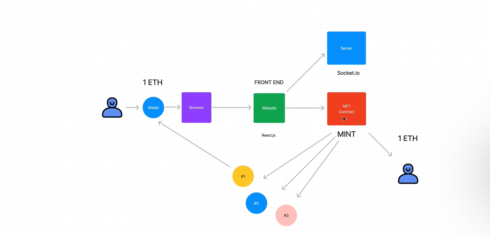
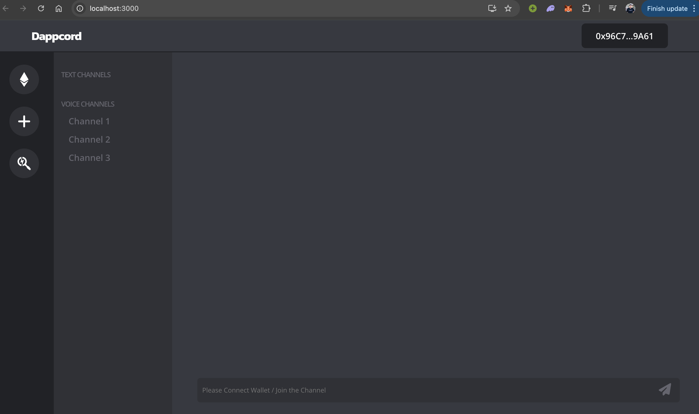

# Dappcord - Decentralized Discord DApp

**A blockchain-powered decentralized communication platform inspired by Discord, where users pay ETH to mint NFT membership tokens for accessing exclusive channels.**

This project demonstrates a full-stack decentralized application (DApp) combining **Solidity smart contracts** for on-chain logic (channel creation, NFT minting for access control, and fund withdrawal) with a **React.js** frontend for user interaction and **Socket.io** for real-time messaging.

The core focus is on robust smart contract development: writing secure, tested Solidity code using modern best practices, comprehensive unit testing, and local deployment with Hardhat.



## Key Features

- **Smart Contract Functionality**:
  - Create new channels on-chain.
  - Mint ERC-721 NFT membership tokens by paying a set amount of ETH (access control via ownership).
  - Owner can withdraw accumulated ETH from mints.
  - Events emitted for real-time frontend updates.

- **Frontend**:
  - Wallet connection (MetaMask).
  - Display channels and membership status.
  - Mint NFT to join paid channels.
  - Real-time chat using Socket.io (off-chain for performance).

- **Real-time Communication**:
  - Socket.io server handles live messaging within channels.



## Technology Stack & Tools

- **Solidity** → Writing Smart Contracts & Comprehensive Tests
- **Hardhat** → Development Framework (Compilation, Testing, Deployment, Local Network)
- **Ethers.js** → Blockchain Interaction & Wallet Integration
- **React.js** → Frontend Framework
- **Socket.io** → Real-time Client-Server Communication
- **Node.js** → Backend Server for Socket.io

## Smart Contract Highlights

The `Dappcord.sol` contract is fully implemented with:
- Channel management (create channels with name and cost).
- ERC-721 NFT minting (unique token ID per membership, cost in ETH).
- Access control (only NFT owners can join channels).
- Secure owner-only withdrawal.
- Events for channel creation and minting.

**Extensive testing** using Hardhat and Chai:
- Covers channel creation, minting, access restrictions, withdrawal, and edge cases.
- Run with `npx hardhat test` → All tests passing.

This showcases expertise in writing production-ready Solidity code, gas optimization, security considerations (reentrancy guards, access controls), and thorough testing.

## Requirements For Initial Setup

- Install [NodeJS](https://nodejs.org/en/) (v16 or higher recommended)
- MetaMask browser extension for wallet interaction

## Setting Up & Running the Project

### 1. Clone/Download the Repository

```bash
git clone https://github.com/Shubhammore71/DISCORD_DAPP.git
cd DISCORD_DAPP
```

### 2. Install Dependencies

```bash
npm install
```

### 3. Run Smart Contract Tests

Verify the Solidity contracts are fully tested and secure:

```bash
npx hardhat test
```

### 4. Start Hardhat Local Node

In a new terminal:

```bash
npx hardhat node
```

### 5. Deploy Smart Contracts Locally

In another terminal:

```bash
npx hardhat run scripts/deploy.js --network localhost
```

(Note the deployed contract address from the output.)

### 6. Start Socket.io Server

```bash
node server.js
```

### 7. Start the React Frontend

```bash
npm run start
```

Open http://localhost:3000 in your browser.

- Connect MetaMask to the Hardhat network (Localhost 8545, Chain ID 31337).
- Use one of the private keys from the Hardhat node for testing.
- Mint an NFT (costs test ETH) to join channels and chat in real-time!

## Future Improvements

- Full channel joining/joining logic enforcement.
- Enhanced UI/UX with more Discord-like features.
- Deployment to testnet/mainnet.
- Additional security audits.

This project highlights strong proficiency in **Solidity**, **Hardhat**, and **Ethers.js** while integrating a functional React frontend. Contributions and feedback welcome! 🚀
